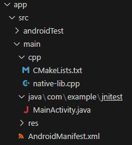
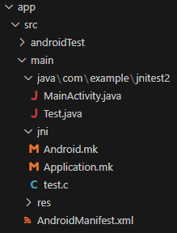

## NDK

#### jnitest
- basic NDK example
- uses CMakelists.txt
- uses ```System.loadLibrary()``` to load library

    

#### jnitest2
- basic NDK example
- uses Android.mk and Application.mk
- uses ```System.loadLibrary()```

    

#### ndk-build-test
- uses Android.mk and Application.mk
- get ABI using c code